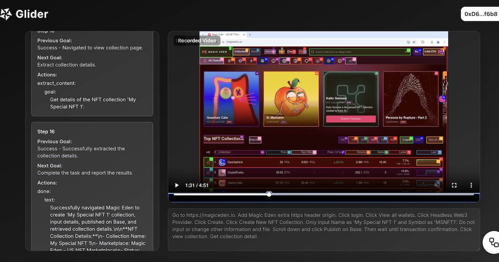
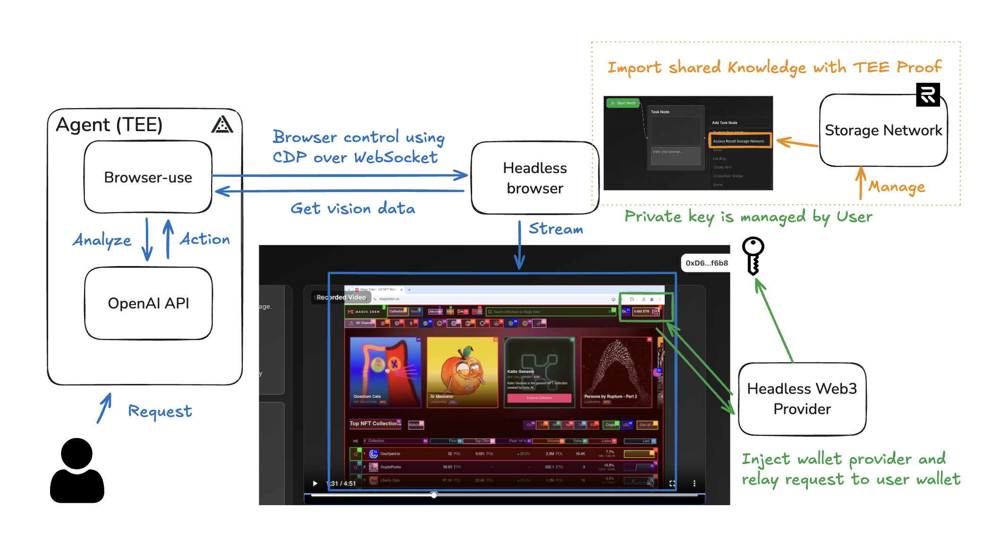

# Glider

## Description

### 1. Service Overview

Glider is an AI-powered platform that autonomously executes front-end browser tasks for Web3 operations. Instead of manually navigating between various dApps, Glider handles the entire UI interaction automatically. The user only needs to approve transactions by signing them with their own pre-owned EOA wallet—ensuring that only transactions you explicitly authorize are executed, with no risk of runaway AI behavior.

### 2. Problem

Manual switching between multiple wallets and dApps is inefficient. Existing AI-plus-crypto tools are limited to SDK/API interactions, failing to cover full UI automation and web workflows. This leaves significant security and custodial risks in asset management.

### 3. Solution & Key Features

Glider leverages advanced browser automation combined with an AI decision engine to fully automate deposits, trades, staking, NFT minting, cross‑chain transfers, and data extraction. By executing all front-end tasks automatically, users simply provide transaction signatures via their EOA wallet. This ensures complete non‑custodial asset management, secure user-approved actions, and seamless operation across any dApp.

### 4. Use Cases

Glider can execute a wide range of crypto actions—from processing vague instructions for asset management to automating yield farming, portfolio rebalancing, arbitrage, NFT operations, and cross‑chain liquidity management. Whether you’re a beginner or an expert, Glider makes complex decentralized finance workflows accessible and efficient.

## Technical Detail

### 🔵 How the AI Agent Works

#### 1. Request Handling

- A user initiates a **request** to the AI **Agent**, which runs inside a **Trusted Execution Environment (TEE)**.

#### 2. Vision + Action Loop

- The Agent uses the `browser-use` module to:
  - Control a **headless browser** via **CDP (Chrome DevTools Protocol) over WebSocket**.
  - Receive **vision data** from the browser (screenshots, DOM elements, etc.).

#### 3. Decision-Making via OpenAI

- Vision data is sent to the **OpenAI API** for analysis and action planning.
- Based on the analysis, the Agent generates an **action** (e.g., click, type, navigate).
- This action is sent back to the headless browser via the `browser-use` control module.

#### 4. Autonomous Control Loop

- The Agent continuously loops through:  
  `Analyze → Act → Observe`  
  Enabling autonomous interaction with web interfaces.

### 🟢 How the Headless Wallet Provider Works

#### 1. Web3 Injection

- The **headless browser** is injected with a **Headless Web3 Provider**, emulating `window.ethereum` in normal dApps.

#### 2. Request Interception

- The provider intercepts Web3 requests (e.g., signing messages or transactions).
- These requests are **forwarded** to the user’s real wallet.

#### 3. Key Security

- **The private key is never exposed to the agent**.
- It is fully **managed by the user**, ensuring secure signing.

---

### 🟠 How Knowledge Storage Works

#### 1. Knowledge Import/Export

- Users can **import shared knowledge** (e.g., workflows, prompts) into the Agent.
- This process is backed by **TEE proof**, verifying that the data originates from a secure enclave.

#### 2. Storage Network

- Knowledge is managed using the **Recall Storage Network**:
  - Stores modular and reusable AI capabilities.
  - Enables collaborative intelligence across agents.

#### 3. UI Integration

- A UI interface allows users to:
  - Click **“Access Recall Storage Network”** to import knowledge modules.
  - Benefit from secure, transparent, and user-consented knowledge sharing.

## Reference

TBD
